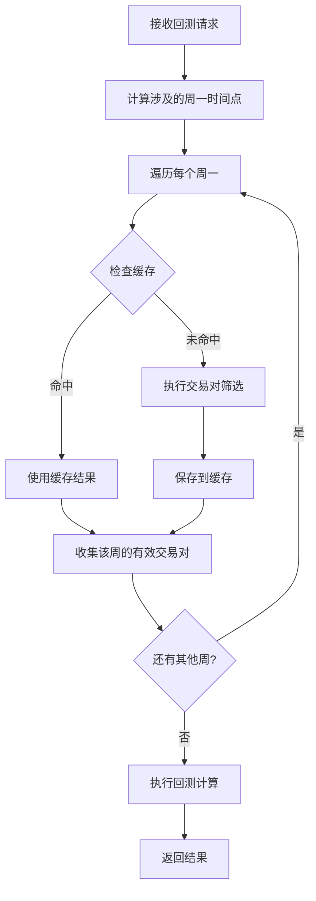

# 周期性 Symbols 计算功能

## 概述

币安成交量回测系统已升级支持**每周一 0 点（UTC+0）重新计算符合条件的交易对列表**的功能。这确保了回测过程中使用的交易对始终反映最新的市场状况和历史数据可用性。

## 核心特性

### 1. 时间周期管理

- **计算频率**: 每周一 0:00:00 UTC 重新计算
- **生效范围**: 该周一至下周一前的所有回测数据点
- **时间对齐**: 系统自动将任意开始时间对齐到对应的周一时间点

### 2. 动态交易对筛选

每周重新执行以下筛选条件：
- 历史数据要求（默认365天）
- 期货合约可用性（可选）
- 稳定币过滤（默认排除）
- 最小成交量阈值
- 交易对活跃状态

### 3. 智能缓存机制

- **缓存键**: 基于周一日期 + 筛选条件生成唯一哈希
- **缓存时效**: 每周计算的结果永久缓存（除非手动清理）
- **缓存复用**: 相同筛选条件的周计算结果可跨请求复用

## 工作原理

### 1. 时间点计算

```typescript
// 输入任意时间范围
startTime: "2024-12-01T10:00:00.000Z"  // 周日
endTime: "2024-12-15T18:00:00.000Z"    // 跨越2周多

// 系统自动计算涉及的周一时间点
weeklyCalculationTimes: [
  "2024-11-25T00:00:00.000Z",  // 第1周周一
  "2024-12-02T00:00:00.000Z",  // 第2周周一
  "2024-12-09T00:00:00.000Z"   // 第3周周一
]
```

### 2. 分周处理流程



### 3. 回测执行逻辑

```typescript
// 对于每个回测时间点
currentTime = "2024-12-05T16:00:00.000Z"

// 1. 确定使用哪一周的交易对
weekStart = getWeekStartTime(currentTime)  // "2024-12-02"
activeSymbols = weeklySymbolsMap.get(weekStart)

// 2. 使用该周的交易对计算排行榜
rankings = calculateRankings(activeSymbols, currentTime)
```

## API 接口变化

### 请求参数

现有的 `VolumeBacktestParamsDto` 参数保持不变，新功能为自动启用。

### 响应格式

响应中新增了周期性计算的相关信息：

```json
{
  "success": true,
  "data": [...],
  "meta": {
    "startTime": "2024-12-01T10:00:00.000Z",
    "endTime": "2024-12-15T18:00:00.000Z",
    "totalHours": 344,
    "dataPoints": 43,
    "processingTime": 45230,
    "weeklyCalculations": 3,  // 新增：涉及的周数
    "symbolStats": {
      "totalDiscovered": 1245,
      "validSymbols": 186,     // 平均每周有效交易对数
      "invalidSymbols": 1059,  // 平均每周无效交易对数
      "validRate": "14.9%",
      "weeklyBreakdown": [     // 新增：每周详细统计
        {
          "weekStart": "2024-11-25",
          "validSymbols": 182,
          "invalidSymbols": 1063,
          "validRate": "14.6%",
          "sampleSymbols": ["BTCUSDT", "ETHUSDT", "BNBUSDT", ...]
        },
        {
          "weekStart": "2024-12-02",
          "validSymbols": 189,
          "invalidSymbols": 1056,
          "validRate": "15.2%",
          "sampleSymbols": ["BTCUSDT", "ETHUSDT", "ADAUSDT", ...]
        },
        {
          "weekStart": "2024-12-09",
          "validSymbols": 187,
          "invalidSymbols": 1058,
          "validRate": "15.0%",
          "sampleSymbols": ["BTCUSDT", "ETHUSDT", "SOLUSDT", ...]
        }
      ],
      "filterCriteria": {
        "minHistoryDays": 365,
        "requireFutures": false,
        "excludeStablecoins": true
      }
    }
  }
}
```

## 性能优化

### 1. 缓存优势

- **减少重复计算**: 相同周的筛选结果可复用
- **提升响应速度**: 缓存命中时跳过耗时的筛选过程
- **降低API负载**: 减少对币安API的重复调用

### 2. 批量处理

- **并发筛选**: 多个周的筛选可并行执行
- **智能重试**: 失败的交易对会自动重试
- **渐进式保存**: 回测结果分批保存，避免内存溢出

### 3. 内存管理

- **滑动窗口**: 每个交易对只保留24小时的K线数据
- **及时清理**: 处理完的中间数据及时释放
- **分页查询**: 大量交易对分批处理

## 使用示例

### 1. 基本回测

```bash
POST /v1/binance/volume-backtest
{
  "startTime": "2024-12-01T00:00:00.000Z",
  "endTime": "2024-12-08T00:00:00.000Z",
  "limit": 50,
  "minVolumeThreshold": 100000,
  "minHistoryDays": 180,
  "granularityHours": 8
}
```

### 2. 跨月回测

```bash
POST /v1/binance/volume-backtest
{
  "startTime": "2024-11-15T00:00:00.000Z",
  "endTime": "2024-12-15T00:00:00.000Z",
  "limit": 30,
  "requireFutures": true,
  "excludeStablecoins": true,
  "granularityHours": 12
}
```

### 3. 查询特定时间点

```bash
GET /v1/binance/volume-backtest?date=2024-12-08&hour=15&limit=20
```

## 缓存管理

### 查看缓存统计

```bash
GET /v1/binance/volume-backtest/cache-stats
```

### 清理过期缓存

```bash
POST /v1/binance/volume-backtest/cache-cleanup
{
  "olderThanDays": 30
}
```

## 实际应用场景

### 1. 长期策略回测

- **时间范围**: 数月至数年
- **优势**: 每周自动更新交易对，反映真实的市场演变
- **适用**: 量化策略的历史回测和验证

### 2. 市场研究分析

- **时间范围**: 特定事件前后数周
- **优势**: 准确反映当时可交易的币种范围
- **适用**: 市场事件影响分析、币种生命周期研究

### 3. 动态选币策略

- **时间范围**: 滚动周期回测
- **优势**: 模拟真实的动态选币过程
- **适用**: 基于成交量排名的选币策略验证

## 注意事项

### 1. 时间对齐

- 系统自动将开始时间对齐到对应的周一
- 如果开始时间在周一之前，会使用上一周的周一数据

### 2. 数据一致性

- 每周的交易对列表可能不同
- 这反映了真实的市场状况和数据可用性变化

### 3. 性能考虑

- 跨越更多周的回测需要更多计算时间
- 建议根据需求调整 `granularityHours` 参数

### 4. 缓存策略

- 缓存基于周一日期和筛选条件
- 修改筛选参数会触发重新计算
- 定期清理缓存以节省存储空间

## 技术细节

### 1. 周一计算公式

```typescript
function getWeekStartTime(date: Date): Date {
  const startOfWeek = new Date(date);
  const dayOfWeek = startOfWeek.getUTCDay();
  const daysToSubtract = dayOfWeek === 0 ? 6 : dayOfWeek - 1;
  
  startOfWeek.setUTCDate(startOfWeek.getUTCDate() - daysToSubtract);
  startOfWeek.setUTCHours(0, 0, 0, 0);
  
  return startOfWeek;
}
```

### 2. 缓存键生成

```typescript
function generateWeeklyFilterHash(weekStart: Date, params: VolumeBacktestParamsDto): string {
  const filterCriteria = {
    weekStart: weekStart.toISOString().slice(0, 10),
    quoteAsset: params.quoteAsset || 'USDT',
    symbols: params.symbols ? [...params.symbols].sort() : [],
    minHistoryDays: params.minHistoryDays || 365,
    requireFutures: params.requireFutures || false,
    excludeStablecoins: params.excludeStablecoins ?? true,
  };
  
  const criteriaString = JSON.stringify(filterCriteria, Object.keys(filterCriteria).sort());
  return createHash('sha256').update(criteriaString).digest('hex');
}
```

### 3. 数据库模型

缓存数据存储在 `symbol_filter_caches` 集合中：

```typescript
{
  _id: ObjectId,
  filterHash: "a1b2c3d4e5f6...",
  weekStart: "2024-12-02",
  filterCriteria: { ... },
  validSymbols: ["BTCUSDT", "ETHUSDT", ...],
  invalidSymbols: ["TESTUSDT", ...],
  invalidReasons: { "TESTUSDT": ["insufficient_history"] },
  totalSymbols: 1245,
  validRate: "15.2%",
  processingTime: 23450,
  createdAt: ISODate("2024-12-02T00:00:00.000Z"),
  lastUsed: ISODate("2024-12-08T10:30:00.000Z")
}
```

## 版本兼容性

此功能为向后兼容的增强，现有的API调用无需修改即可享受新功能的优势。